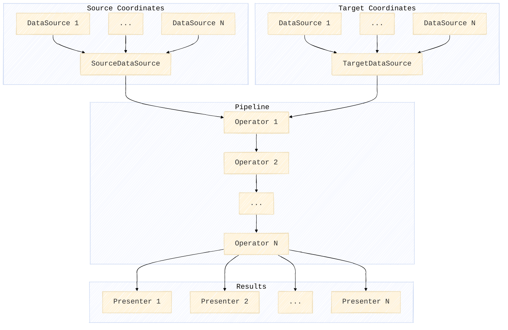

# Architecture

Transformo is built using a pipeline architecture that revolves around three types of
components: *DataSources*, *Operators* and *Presenters*.

A number of DataSources can be
fed to a pipeline of Operators, that defines the desired transformation to estimate
parameters for, and the resulting parameters and related statistics are returned using
Presenters. The figure below give a schematic overview of the concept.

*DataSources* gathers sets of source and target coordinates and assembles them in a
standardized internal form and *Presenters* presents the derived transformation model
and related statistics in standardized formats.

The *Operators* derive parameters for selected transformation techniques, for
instance a Helmert transformation. In case of several chained operators the later
steps are presented with the residuals of the earlier transformation estimate for
which the current operator can attempt to reduce even further using a different
transformation technique.

## DataSources

DataSources consumes data from a single data source and provide it on a standardized
form. The following information can be read with a datasource:

1. Station name
2. Coordinate tuple (x,y,z)
3. Uncertainty estimate of the coordinate (standard deviation)
4. Weight (>= 0.0)
5. Timestamp

Source and target coordinate data is handled by different datasource instances. At
least one datasource is needed for both source and target data sources but more than
one can be supplied for each.

## Presenters

Presenters deliver the resulting estimated transformation parameters in sensible
formats. Parameters for a Helmert transformation might be presented as a
PROJ-string, a WKT2 description and a simple text representation. A grid based
transformation might result in a GTG file or a more complex transformation involving
several steps could be returned as a PROJ pipeline.

Presenters aren't limited to only presenting the estimated parameters. A presenter
can also return intermediate results, residuals and various other statistics relevant
to the transformation at hand.

## Operators

Operators are essential components in the Transformo pipeline. All operators
have the ability to manipulate coordinates, generally in the sense of a geodetic
transformation. In addition operators *can* implement a method to derive
parameters for said coordinate operation. Most operators do, but not all.

So, operators have two principal modes of operation:

1. Coordinate operations, as defined in the ISO 19111 terminology
2. Estimating parameters for the coordinate operations

The abilities of a operator are determined by the methods that enheriting classes
implement. *All* Operator's must implement the `forward` method and they *can*
implement the `estimate` and `inverse` methods. If only the `forward` method is
implemented the operator will exist as a coordinate operation that can't
estimate parameters.
