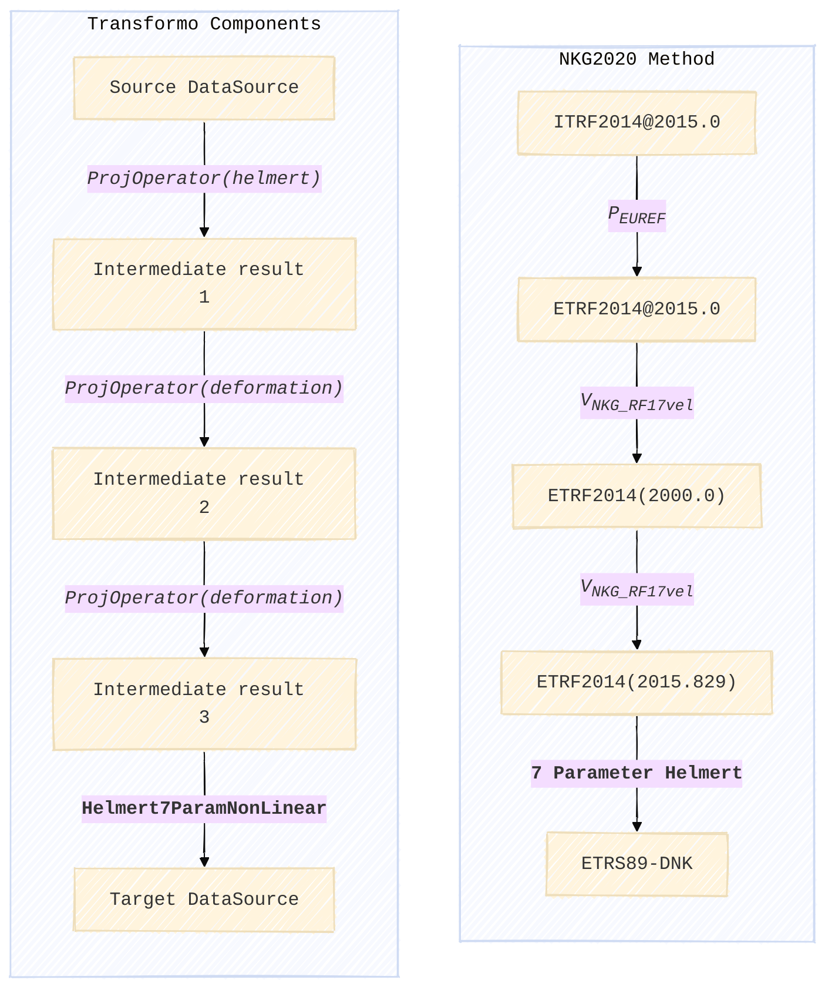
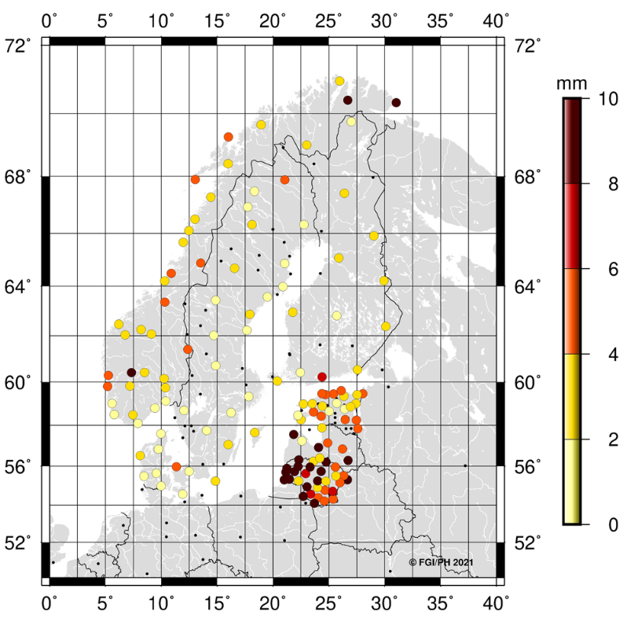
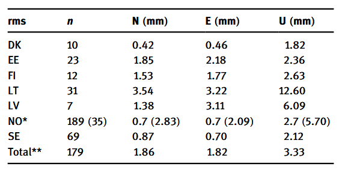
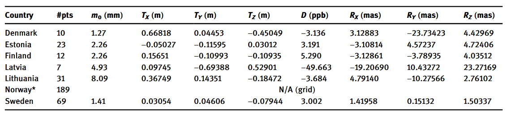

# Use cases

## Transformation parameters for Nordic and Baltic ETRS89 realisations

Within the Nordic Geodetic Commision Nordic and Baltic countries collaborate
on producing geodetic transformations between ITRS and ETRS89. The collaboration
focuses on producing transformations that account for the significant GIA signal
observed across the region. The transformations are collectively known as the
"NKG Transformations" and so far they exist in two versions. The first is based
on a GPS campaign from 2008 (Häkli et al, 2016) and the second presents and update
based on data from 2020 (Häkli et al, 2023). In the following it is demonstrated
how to recreate the results of the NKG2020 transformations using Transformo.

The NKG transformation method consists of several transformation steps. The
first part creates a path between ITRS and a hub reference frame called NKG_ETRF14.
The second part connects the NKG_ETRF14 and the individual nation realisations of
ETRS89. Transformation parameters are only derived for the latter part. Here the
method is demonstrated for Denmark but the principle is shared between all seven
countries involved.

<center>

<i>Figure 1. Schematic overview of the transformation. On the left the setup is given in terms of the used
Transformo components and on the right the transformation steps and intermediate reference frames and
epochs are displayed.</i>
</center>

The schematics of Figure 1 is expressed as a Transformo pipeline below. Note the
pre-processing command, that ensure that PROJ has access to the NKG deformation model.
The source and target data is supplied in CSV-files with only station names and coordinates
available, so in both cases an epoch and uncertainties are supplied. The uncertainties are
set to 0 in this case, meaning that these are defining coordinates with no uncertainty.
This equals the approach used for the NKG2020 transformations. The ITRF2014-coordinates
are not defining the frame though, so a fairer approach would be to include uncertainty
estimates for those.

```yaml
pre_processing_commands:
- projsync --file eur_nkg

source_data:
- name: ITRF2014@2015.0
  type: csv
  filename: ITRF2014_DK.csv
  columns: [station, x, y, z]
  t: 2015.0
  sx: 0
  sy: 0
  sz: 0

target_data:
- name: ETRS89-DNK
  type: csv
  filename: ETRS89_DK.csv
  columns: [station, x, y, z]
  t: 2015.829
  sx: 0
  sy: 0
  sz: 0

operators:
- name: ITRF2014@2015.0 to ETRF2014@2015.0
  type: proj_operator
  proj_string: +proj=helmert
               +rx=0.001785 +ry=0.011151 +rz=-0.01617 +s=0
               +drx=8.5e-05 +dry=0.000531 +drz=-0.00077 +ds=0
               +t_epoch=2010 +convention=position_vector

- name: ETRF2014@2015.0 to ETRF2014@2000.0 (NKG_ETRF14)
  type: proj_operator
  proj_string: +proj=deformation
               +grids=eur_nkg_nkgrf17vel.tif
               +t_epoch=2000 +ellps=GRS80 +inv

- name: ETRF92@2000.0 to ETRS89-DNK
  type: proj_operator
  proj_string: +proj=deformation
               +grids=eur_nkg_nkgrf17vel.tif
               +dt=15.829 +ellps=GRS80

- name: NKG_ETRF14@2000.0 to ETRF92@2000.0
  type: helmert_7param_nonlinear
  convention: position_vector
  small_angle_approximation: false

presenters:
- type: topocentricresidual_presenter
  name: ENU Residuals
  coordinate_type: cartesian

- type: proj_presenter
  name: PROJ String
```

The pipeline is processed by running

```
$ transformo --markdown --report-in-terminal recreate_nkg2020_dk.yaml
```

The results are presented below and compared to source of truth in Häkli et al (2023).

### Results

Output of the Presenters in a slightly modified form.

#### Station coordinate residuals

Residuals in topocentric space of the modelled coordinates as compared to target cooordinates.
The table contains coordinate differences of the individual coordinate components as well as
the norm of the residual vector, both in the plane and across all dimensions.

|Station|    East    |   North    |     Up     |Planar residual|Total residual|
|-------|------------|------------|------------|---------------|--------------|
| BUDP  | -0.159     | -0.0631    |  0.571     |   0.171       |   0.596      |
| ESBC  |  0.328     |  0.277     | -0.527     |   0.429       |   0.679      |
| FER5  | -0.0516    | -0.39      |  2.73      |   0.394       |   2.75       |
| FYHA  |  0.916     |  0.0012    |  0.996     |   0.916       |   1.35       |
| GESR  | -0.361     |  0.085     | -1.37      |   0.371       |   1.42       |
| HABY  |  0.417     | -0.264     | -4.08      |   0.494       |   4.11       |
| HIRS  | -0.642     | -0.145     | -0.629     |   0.659       |   0.91       |
| SMID  | -0.467     |  1.05      |  0.0992    |   1.15        |   1.15       |
| SULD  | -0.303     |  0.0332    | -0.052     |   0.305       |   0.309      |
| TEJH  |  0.273     | -0.598     |  2.27      |   0.658       |   2.37       |

The paper doesn't include a similar table but Figure 3 presents the 3D residuals
in a visual form. By comparing the figure with the data in the table we see that
the two stations with higher residuals (FER5, HABY) correspond to the two Danish
stations with residuals in the 2-4 mm and 4-6 mm brackets:



#### Residual statistics

Looking at the statistics of the residual we get the data below from Transformo

|Measure|    East    |   North    |     Up     |Planar residual|Total residual|
|-------|------------|------------|------------|---------------|--------------|
|  avg  | -0.00489   | -0.00122   | -2.75e-06  |   0.555       |   1.57       |
|  std  |  0.456     |  0.424     |  1.82      |   0.282       |   1.57       |

which is closely aligned with the statistics in Table 2 of Häkli et al (2023):



where the standard deviation (RMS) of the east, north and up components are the
same.

#### Helmert Parameters

Transformo returns the estimated Helmert parameters as a [PROJ](https://proj.org/) string.
We get the PROJ string for the entire transformation including all steps between ITRS and ETRS89:

```
+proj=pipeline
+step +proj=helmert +proj=helmert +rx=0.001785 +ry=0.011151 +rz=-0.01617 +s=0 +drx=8.5e-05 +dry=0.000531 +drz=-0.00077 +ds=0 +t_epoch=2010 +convention=position_vector
+step +proj=deformation +proj=deformation +grids=eur_nkg_nkgrf17vel.tif +t_epoch=2000 +ellps=GRS80 +inv
+step +proj=deformation +proj=deformation +grids=eur_nkg_nkgrf17vel.tif +dt=15.829 +ellps=GRS80
+step +proj=helmert +x=0.66818 +y=0.04453 +z=-0.45049 +rx=0.00312873 +ry=-0.02373416 +rz=0.00442974 +s=-0.003136 +convention=position_vector
```

Isolating the relevant Helmert step we get

| x [m]   | y [m]   | z [m]    | s [ppm]   | rx [arc sec]   | ry [arc sec]   | rz [arc sec]   |
|---------|---------|----------|-----------|----------------|----------------|----------------|
| 0.66818 | 0.04453 | -0.45049 | -0.003136 | 0.00312873     | -0.02373416    | 0.00442974     |

Comparing to Table 3 (Häkli et al, 2023) we see that the translation and scale parameters are
exactly the same and that slight variations are observed in the rotation parameters. The
differences are at the level of 10<sup>-6</sup> arcseconds and can be regarded as negligable.



### Conclusion

Transformo recreates the results in the NKG2020 transformations paper almost exactly. Negligable
differences in the rotation parameters of the Helmert transformations are found which can
likely be attributed to different convergence criteria in the iterative solution.

Overall Transformo is able to produce reliable results on par with existing code.

## References

- [Häkli, P., Lidberg, M., Jivall, L., Nørbech, T., Tangen, O., Weber, M., Pihlak, P., Aleksejenko, I. and Paršeliunas, E. (2016),](https://doi.org/10.1515/jogs-2016-0001), **The NKG2008 GPS campaign – final transformation results and a new common Nordic reference frame**. Journal of Geodetic Science, Vol. 6 (Issue 1).

- [Häkli, P., Evers, K., Jivall, L., Nilsson, T., Himle, S., Kollo, K., Liepiņš, I., Paršeliūnas, E., Vestøl, O. and Lidberg, M. (2023)](https://doi.org/10.1515/jogs-2022-0155), **NKG2020 transformation: An updated transformation between dynamic and static reference frames in the Nordic and Baltic countries**. Journal of Geodetic Science, Vol. 13 (Issue 1)
